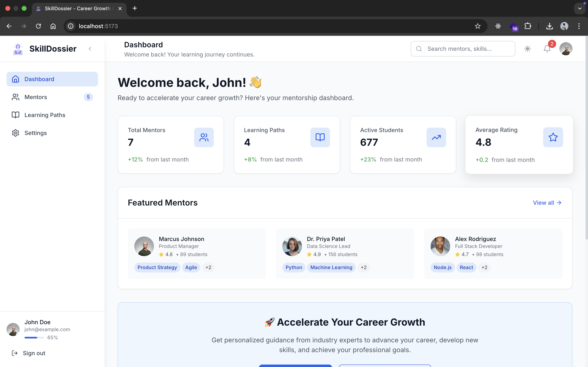
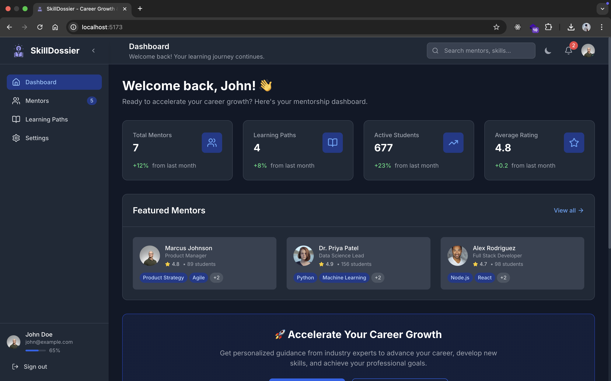
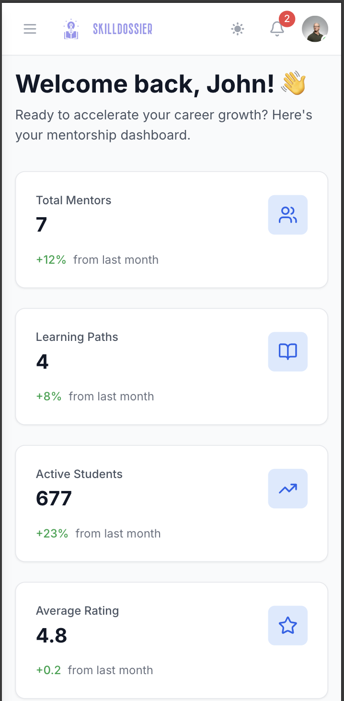

# 🚀 SkillDossier - Career Growth & Mentorship Platform

<br/>

<div align="center">
  
  
  <br />
  
  **Empowering Career Growth Through Expert Mentorship**
</div>

<br/>

---

[](https://github.com/rishis26/SkillDossier.git)
[](https://reactjs.org/)
[](https://www.typescriptlang.org/)
[](https://tailwindcss.com/)
[](https://vitejs.dev/)

> **A modern, responsive mentorship platform that connects learners with industry experts to accelerate career growth and skill development.**

## 📋 Table of Contents

- [🎯 Project Overview](#-project-overview)
- [✨ Features](#-features)
- [🏗️ Architecture & Flow](#️-architecture--flow)
- [🛠️ Tech Stack](#️-tech-stack)
- [📱 Screenshots](#-screenshots)
- [🚀 Quick Start](#-quick-start)
- [📦 Installation & Setup](#-installation--setup)
- [🔧 Development](#-development)
- [📚 API Integration](#-api-integration)
- [♿ Accessibility Features](#-accessibility-features)
- [🎨 UI/UX Features](#-uiux-features)
- [📱 Responsive Design](#-responsive-design)
- [🚀 Deployment](#-deployment)
- [🤝 Contributing](#-contributing)
- [📄 License](#-license)

## 🎯 Project Overview

**SkillDossier** is a comprehensive career growth and mentorship platform designed to bridge the gap between learners and industry professionals. The platform focuses on:

- **🎓 Career Development**: Structured learning paths for professional growth
- **🤝 Mentor-Mentee Connections**: Direct connections with industry experts
- **📚 Skill Development**: Comprehensive skill-building resources and guidance
- **🚀 Future Readiness**: Preparing professionals for the evolving job market

### 🎯 **Target Users**
- **Students**: Looking to develop career-relevant skills
- **Professionals**: Seeking career advancement and skill development
- **Career Changers**: Transitioning to new industries or roles
- **Mentors**: Industry experts wanting to share knowledge

## ✨ Features

### 🎯 **Core Functionality**
- **Dashboard**: Overview with key metrics, featured mentors, and career opportunities
- **Mentor Discovery**: Advanced search and filtering system
- **Learning Paths**: Structured career development programs
- **User Settings**: Profile management and preferences

### 🌟 **Advanced Features**
- **Real-time Search**: Instant mentor filtering and discovery
- **Smart Matching**: AI-powered mentor-mentee pairing
- **Progress Tracking**: Visual progress indicators and milestones
- **Notification System**: Real-time updates and reminders

### 🎨 **UI/UX Features**
- **Dark/Light Mode**: Seamless theme switching with system preference detection
- **Smooth Animations**: 60fps animations with Framer Motion
- **Responsive Design**: Mobile-first approach with excellent cross-device support
- **Interactive Elements**: Hover effects, micro-interactions, and smooth transitions

## 🏗️ Architecture & Flow

### 📊 **System Architecture**
```
┌─────────────────┐    ┌─────────────────┐    ┌─────────────────┐
│   Frontend      │    │   State         │    │   Components    │
│   (React + TS)  │◄──►│   Management    │◄──►│   (Reusable)    │
└─────────────────┘    └─────────────────┘    └─────────────────┘
         │                       │                       │
         ▼                       ▼                       ▼
┌─────────────────┐    ┌─────────────────┐    ┌─────────────────┐
│   Routing       │    │   Context API   │    │   Styling       │
│   (React Router)│    │   (Theme)       │    │   (Tailwind)    │
└─────────────────┘    └─────────────────┘    └─────────────────┘
```

### 🔄 **User Flow**
```
1. User Landing
   ↓
2. Authentication/Profile Setup
   ↓
3. Dashboard Overview
   ↓
4. Explore Learning Paths OR Find Mentors
   ↓
5. Connect with Mentors OR Start Learning Path
   ↓
6. Track Progress & Continue Learning
   ↓
7. Achieve Career Goals
```

### 📱 **Component Hierarchy**
```
App.tsx
├── ThemeProvider
├── Router
│   └── Layout.tsx
│       ├── Sidebar (Navigation)
│       ├── TopBar (Search, Theme, Notifications)
│       └── Main Content
│           ├── Dashboard.tsx
│           ├── Mentors.tsx
│           ├── LearningPaths.tsx
│           └── Settings.tsx
└── Components
    ├── ConnectionModal.tsx
    ├── NotificationSystem.tsx
    └── LoadingSpinner.tsx
```

## 🛠️ Tech Stack

### **Frontend Framework**
- **React 19.1.1** - Latest React with concurrent features
- **TypeScript 5.8.3** - Type-safe development
- **React Router v6** - Client-side routing

### **Styling & UI**
- **Tailwind CSS 3.4.17** - Utility-first CSS framework
- **Framer Motion 12.23.12** - Production-ready motion library
- **Lucide React 0.542.0** - Beautiful, customizable icons

### **Build Tools**
- **Vite 7.1.2** - Fast build tool and dev server
- **PostCSS 8.5.6** - CSS processing
- **ESLint 9.33.0** - Code quality and consistency

### **Development Tools**
- **Node.js 18+** - Runtime environment
- **npm** - Package manager
- **Git** - Version control

## 📱 Screenshots

### 🖥️ **Desktop View - Light Theme**
<div align="center">
  
  <br/>
  <em>Main dashboard with sidebar navigation, stats grid, and featured mentors in light theme</em>
</div>

<br/>

### 🌙 **Desktop View - Dark Theme**
<div align="center">
  
  <br/>
  <em>Elegant dark theme with proper contrast and readability, showing the same dashboard layout</em>
</div>

<br/>

### 📱 **Mobile View**
<div align="center">
  
  <br/>
  <em>Responsive mobile design with collapsible sidebar and touch-friendly interface</em>
</div>

## 🎨 **Visual Showcase**

<div align="center">
  <table cellpadding="20" cellspacing="20">
    <tr>
      <td align="center">
        <strong>🎯 Dashboard Overview</strong><br/>
        
      </td>
      <td align="center">
        <strong>🌙 Dark Theme</strong><br/>
        
      </td>
    </tr>
    <tr>
      <td align="center">
        <strong>📱 Mobile Responsive</strong><br/>
        
      </td>
      <td align="center">
        <strong>🚀 Modern UI/UX</strong><br/>
        <em>Professional design with smooth animations</em>
      </td>
    </tr>
  </table>
</div>

## 🚀 Quick Start

### **Prerequisites**
- Node.js 18.0.0 or higher
- npm 8.0.0 or higher
- Git

### **Clone & Setup**
```bash
# Clone the repository
git clone https://github.com/rishis26/SkillDossier.git

# Navigate to project directory
cd SkillDossier

# Install dependencies
npm install

# Start development server
npm run dev
```

### **Open in Browser**
Navigate to `http://localhost:5173` to view the application.

## 📦 Installation & Setup

### **1. Repository Setup**
```bash
# Clone the repository
git clone https://github.com/rishis26/SkillDossier.git

# Navigate to project directory
cd SkillDossier

# Check current branch
git branch -a
```

### **2. Dependencies Installation**
```bash
# Install all dependencies
npm install

# Verify installation
npm list --depth=0
```

### **3. Environment Configuration**
```bash
# Create environment file (if needed)
cp .env.example .env

# Configure environment variables
# Add your API keys and configuration
```

### **4. Development Server**
```bash
# Start development server
npm run dev

# The app will be available at:
# http://localhost:5173
```

## 🔧 Development

### **Available Scripts**
```bash
# Development
npm run dev          # Start development server with hot reload
npm run build        # Build for production
npm run preview      # Preview production build locally
npm run lint         # Run ESLint for code quality

# Production
npm run build        # Create optimized production build
npm run deploy       # Deploy to hosting platform
```

### **Project Structure**
```
SkillDossier/
├── public/                 # Static assets
│   ├── logo/              # Application logos
│   └── vite.svg           # Vite logo
├── src/                   # Source code
│   ├── components/        # Reusable UI components
│   │   ├── Layout.tsx     # Main layout with navigation
│   │   ├── ConnectionModal.tsx # Mentor connection interface
│   │   ├── NotificationSystem.tsx # Notification management
│   │   └── LoadingSpinner.tsx # Loading states
│   ├── contexts/          # React contexts
│   │   └── ThemeContext.tsx # Theme management
│   ├── data/              # Mock data and interfaces
│   │   └── mentors.ts     # Mentor profiles and learning paths
│   ├── hooks/             # Custom React hooks
│   ├── pages/             # Page components
│   │   ├── Dashboard.tsx  # Main dashboard
│   │   ├── Mentors.tsx    # Mentor discovery
│   │   ├── LearningPaths.tsx # Career development paths
│   │   └── Settings.tsx   # User preferences
│   ├── types/             # TypeScript type definitions
│   ├── App.tsx            # Main application component
│   ├── main.tsx           # Application entry point
│   └── index.css          # Global styles
├── .eslintrc.js           # ESLint configuration
├── tailwind.config.js     # Tailwind CSS configuration
├── tsconfig.json          # TypeScript configuration
├── vite.config.ts         # Vite build configuration
└── package.json           # Project dependencies and scripts
```

### **Code Quality**
```bash
# Run linting
npm run lint

# Fix auto-fixable issues
npm run lint -- --fix

# Check TypeScript compilation
npx tsc --noEmit
```

## 📚 API Integration

### **Current Implementation**
- **Mock Data**: Currently using static data in `src/data/mentors.ts`
- **Data Structure**: Well-defined TypeScript interfaces for easy API integration
- **Search Functionality**: Real-time filtering and search capabilities

### **Future API Integration**
```typescript
// Example API service structure
interface MentorService {
  getMentors(filters: MentorFilters): Promise<Mentor[]>;
  getMentorById(id: number): Promise<Mentor>;
  connectWithMentor(mentorId: number, message: string): Promise<Connection>;
  getLearningPaths(): Promise<LearningPath[]>;
  updateUserProgress(pathId: number, progress: number): Promise<void>;
}
```

### **Data Models**
```typescript
// Core data interfaces
interface Mentor {
  id: number;
  name: string;
  title: string;
  company: string;
  skills: string[];
  rating: number;
  availability: string;
  // ... more properties
}

interface LearningPath {
  id: number;
  title: string;
  description: string;
  skills: string[];
  mentors: Mentor[];
  progress: number;
}
```

## ♿ Accessibility Features

### **WCAG 2.1 AA Compliance**
- **Color Contrast**: Proper contrast ratios for both light and dark themes
- **Typography**: Readable font sizes and line heights
- **Focus Indicators**: Clear focus states for keyboard navigation

### **Screen Reader Support**
- **ARIA Labels**: Comprehensive labeling for all interactive elements
- **Semantic HTML**: Proper heading hierarchy and landmark roles
- **Alt Text**: Descriptive alt text for all images and icons

### **Keyboard Navigation**
- **Full Keyboard Support**: All functionality accessible via keyboard
- **Shortcuts**: Ctrl/Cmd+K for search, Escape for closing modals
- **Focus Management**: Logical tab order and focus indicators

### **Accessibility Testing**
```bash
# Install accessibility testing tools
npm install --save-dev axe-core @axe-core/react

# Run accessibility audit
npm run test:a11y
```

## 🎨 UI/UX Features

### **Design System**
- **Color Palette**: Professional blue and gray tones with semantic colors
- **Typography**: Inter font family with proper hierarchy
- **Spacing**: Consistent 8px grid system
- **Components**: Reusable, accessible component library

### **Animation System**
- **Framer Motion**: 60fps animations with spring physics
- **Micro-interactions**: Hover effects, button states, and transitions
- **Loading States**: Smooth loading animations and skeleton screens
- **Page Transitions**: Elegant page-to-page navigation

### **Theme System**
- **Light Mode**: Clean, professional appearance
- **Dark Mode**: Easy on the eyes with proper contrast
- **System Preference**: Automatic theme detection
- **Persistent Storage**: User preference remembered
